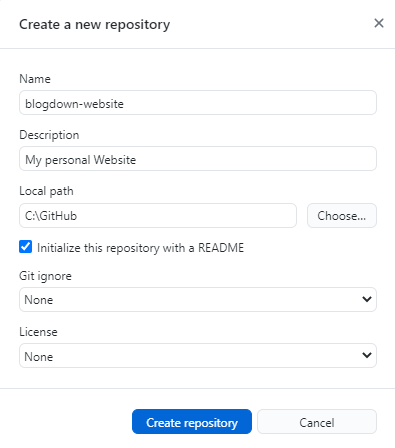
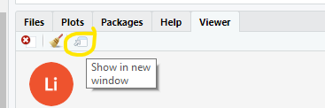

I have been listening to Emily Robinson and Jacqueline Nolis's <u>Build a Career in Data Science</u> on [Audible](https://www.audible.com/pd/Build-a-Career-in-Data-Science-Audiobook/B08NXJ6S38?action_code=ASSGB149080119000H&share_location=pdp). Chapter 4 explains how to go about creating a portfolio of data science projects. Your portfolio should demonstrate your skills, both in data analytics, and in communication. Emily and Jacqueline suggest you manage your code in GitHub repositories, and summarize your results in blog posts and Twitter posts. I have a [GitHub account](https://github.com/mpfoley73) with a few repos in it, but no website to blog about what I've done. Following their suggestion, I investigated R blogdown. After only a few days I am writing my first blog post. Here is how you can do it too.

## What You'll Need

You won't need much. I read Yihui Xie's [blogdown: Creating Websites with R Markdown](https://bookdown.org/yihui/blogdown/) and followed along to create this site and publish it to the Netify web hosting service. The book is not long; you can reasonably expect to do the same in about four hours. What might set you back is the occasional false start and misunderstanding. This post should help you avoid some of that.

You will need a [GitHub](https://github.com/) account. I don't cover that here, so if you don't have any experience with GitHub, take a step back and get your (free) account and learn how to use it.

Also, you will need the RStudio IDE.

## The Gameplan

Here's what you want to do. 

1. Create a new repo on GitHub for our website files.
2. Create a website with **blogdown** in RStudio.
3. Host the website on Netify.
4. Personalize your website.
5. Start posting!

I recommend you start by skimming through this post to get a feel for what it's going to take to do this. Then carefully follow along through chapters 1-3 of Yihui's book to build you site. Refer back to this post for help. Yihui is the master guide, and I just now experienced this. Both perspectives can be useful to you.

Let's go!

## 1. Create Your Repo

If you haven't done so already, create an account at github.com and install the desktop application on your computer. From the GitHub Desktop application, create a new repository. My repo is named "blogdown-website".



I originally built my website first (step 2). I realized when I tried to host the website with Netify (step 3) that my website files belong in a repo. It shouldn't have been a big deal to move my files into a repo, but it took me a couple hours to undo the mess I made. GitHub mystifies me. My advice: *create your repo first.*

## 2. Create Your Website

Open RStudio. Install the **blogdown** package.

```
install.packages("blogdown")
```

Create a **Website using blogdown** project in your new repo by navigating to File > New Project... > New Directory > Webite using blogdown. Follow Yihui's [screen shots and instructions](https://bookdown.org/yihui/blogdown/a-quick-example.html). Your website has static content that will be presented under a common theme (font faces, colors, layout, etc.). You can customize or pick a new theme, but I recommend you stay with the defaults. *Let customization be a future phase in your journey*.

Creating a website project creates a sample website complete with 3 sample blog posts (./content/post), and an About page (./content/about.md). You can preview your new web site locally in the Viewer tab of the navigation pane by by selecting *Serve Site* from the Addins menu.


You can even see it in a web browswer by selecting *Show in new window* from the View tab.



Great, now you have a web site. It's basically the "hello world" of web sites, but huge progress. Check in your code on GitHub and push to origin.

## 3. Create a Netify Account

**blogdown** creates the web pages, but you need to host them somewhere. Yihui shows you how to work with several web hosting services, but recommends Netify. It has free plans, and you can integrate it with GitHub to automatically update your web site when you commit changes to your main branch.

Got to [https://www.netlify.com](https://www.netlify.com) and click "Sign up". Choose the free start plan. Netify asks you to create a team. I called my team "Data Analytics". Then from the team page, click "New site from Git".


This will open a wizard to connect Netify to your GitHub repository and deploy your site. 

Whenever you push your changes up to origin, Netify will be able to access them. Netify will build your web pages by compiling the markdown documents to html.

Now you officially have a web site for other people to see. Time to personalize it so the world doesn't see your crummy template, but rather, your own stuff.

## 4. Personalize Your Website


## 5. Write Your First Post
