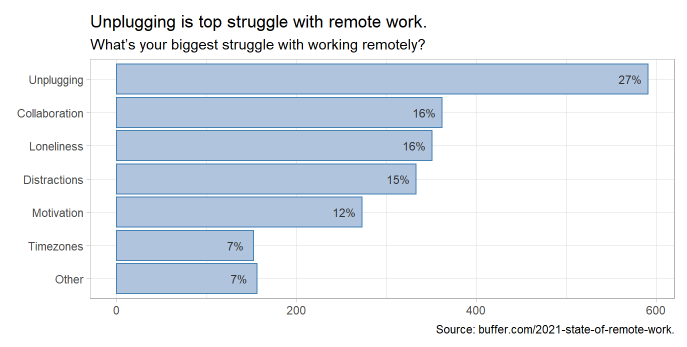
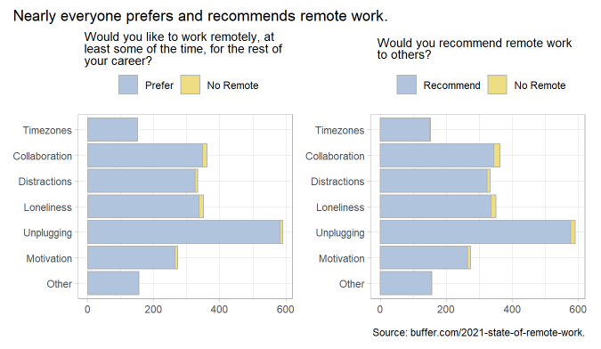

Buffer published [The 2021 State of Remote Work](https://buffer.com/2021-state-of-remote-work), a summary of a survey of over 2,000 remote workers in late 2020 and made the data available as a Google sheets file on [Google Docs]("https://docs.google.com/spreadsheets/d/1aJFW-_Rq3xNa2Fos-raoA1sF23CwT9sLAfHopjMZnLs/edit?usp=sharing"). BTW, the report is a follow up to their [2020 survey](https://lp.buffer.com/state-of-remote-work-2020) which was featured in [MakeoverMonday](https://data.world/makeovermonday/2020w32), a great program devoted to rethinking data visualization. 

Buffer found that remote workers overwhelmingly support remote work. However, they did share struggles such as difficulty unplugging from the office, collaborating, and loneliness. I'm curious what factors might predict struggles.

The survey asked a few dozen questions related to remote-work, most of them multiple choice (full list [here](projects/remote-work/1_get_data.html). Some questions were personal (respondent's race, industry, job, experience level). Some focused on what drew them into remote work (a disability, being a caretaker to a child or family member, or COVID). Others related to how remote work changed their lives (working more/less, was the transition smooth, what changed the most).

Predicting which among several discrete states an observation will take is a _multiple classification_ task. So binary logistic regression is off the table. But several other methods are still open. There is multinomial logistic regression (which I know nothing about), classification trees, and *k* nearest neighbors (kNN). I've decided to go with kNN.

If you are interested, my project code is on [GitHub](https://github.com/mpfoley73/remote-work), and published [here](/projects/remote-work/). The first thing I discovered that nearly every respondent preferred remote work.

So when exploring and predicting the attributes associated with remote-work struggles, it's important to recognize that these are people who like remote work, and are asked to select _something_ negative, even if it is just a _little_ negative. [Section 2](/projects/remote-work/2_explore.html) of my report includes a series of univariate analysis charts showing the distrution of struggles related to the responses to other survey questions. There were some predictable associations, and some insightful ones:

* New workers were struggled most with motivation. More experienced workers struggled with loneliness - but more experienced the worker, the less the struggle.
* Parents and caregivers were much more likely to struggle with distractions. The upside is that they were also less likely to feel lonely.
* Smaller organizations struggle with distractions, motivation; bigger with unplugging.

## Modeling with KNN

The kNN model is conceptually straight-forward. kNN predicts the classification of each observation by looking at the *k* observations that are "closest" to it. "Close" can mean different things, but its usually something like the Euclidean distance between all the preditor variables. That can be an issue for categorical variables who's one-hot encoded values are either 0 or 1. As I discovered [here](https://quantdev.ssri.psu.edu/sites/qdev/files/kNN_tutorial.html) and [here](https://stats.stackexchange.com/questions/271043/k-nearest-neighbour-with-continuous-and-binary-variables), classification algorithms struggle with categorical predictors.

My kNN algorithm predicted the most popular struggle, *unplugging*, about 97% of the time (full analysis [here](/projects/remote-work/3_knn.html))! If you had to guess one, you might as well guess the most popular struggle. Looking at the variable importance measures, the response to the survey item "*Are you working remotely as a result of COVID-19?*" was by far the most important variable. That was particularly surprising because it didn't seem to be particularly predictive of any struggle other than perhaps dealing with timezone difference with other employees.

## What to conclude?

I consider this project a failure, at least in terms of identifying the important factors underlying struggles with remote-work. I wonder what kinds of results I would have gotten if I had numeric predictor variables. It might also have helped to have respondents who were not so overwhelming unified in their approval of remote-work - with so little variation in the data, it's hard to tease out causes of variation!
