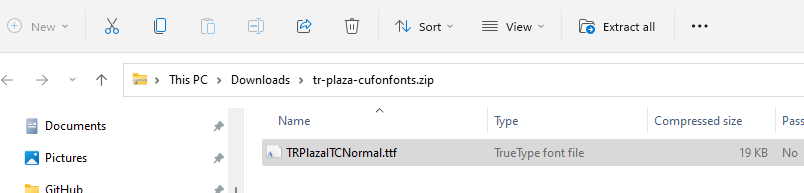
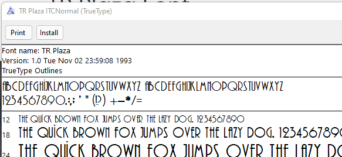
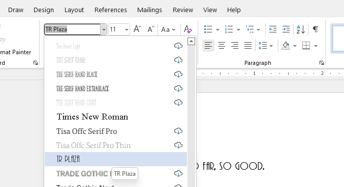
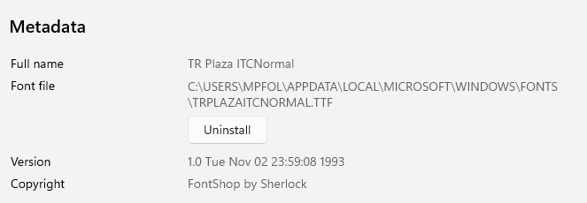
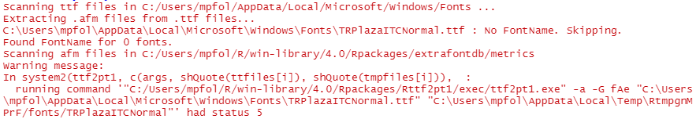
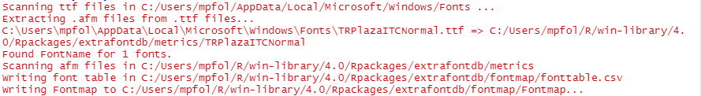

```{r setup, include=FALSE}
library(tidyverse)
library(lubridate)
```

For my new survival analysis project on [baseball career longevity](https://mpfoley73.github.io/baseball-survival/), I am using the TR Plaza font [adopted by the Cleveland Guardians](https://www.cleveland.com/entertainment/2022/04/cleveland-guardians-adopt-refreshed-design-look-to-go-with-new-name.html) for the 2022 season. Style choices shouldn't be gratuitous, but I feel like using the Guardians font for my graphics connects statistical analysis to the underlying topic of baseball. Anyway, it's cool, so I'm doing it.


:::: {style="display: grid; grid-template-columns: 1fr 1fr; grid-column-gap: 10px;"}

::: {}
### Before


:::

::: {}
### After


:::

::::

I ran into difficulties adding the font, so I'm capturing the process here to smooth the way for you and for future me. These instructions explain how to change the font face used in your R graphics. It does not change the text output.

## The standard way

If you already have the font installed on you system (i.e., it's an available font in Microsoft Word), then you can follow the steps in [this tutorial](https://r-coder.com/custom-fonts-r/) by R Coder. Here is an overview.

The **extrafont** package ([GitHub](https://github.com/wch/extrafont)) makes system fonts available for bitmap output. It maintains a database of the font metadata. Install the package. The installation will automatically bring in two other utility packages, **extrafontdb** and **Rttf2p1**.

```{r eval=FALSE}
install.packages("extrafont")
```

You only have to create the database of fonts on your system once. After that, it will be available to you whenever you load the **extrafont** package in your session. Create the database with `font_import()`.

```{r eval=FALSE}
library(extrafont)
font_import()
```

This took my laptop about 15 minutes to run. Once its done, you can include your fonts in your ggplots like this.

```{r warning=FALSE}
library(tidyverse)
library(extrafont)

# Extrafont documentation has you load the fonts, but I accidentally left this
# out and it worked anyway. When you run the `library()` statement it outputs a
# message that it is "Registering fonts with R."
# loadfonts(device="win")

ggplot(mtcars, aes(x=wt, y=mpg)) + geom_point() +
  ggtitle("Georgia font!") +
  theme(text = element_text(size = 16, family="Agency FB", face="italic"))
```

The key is setting the `family` argument of the `element_text()` function. How do you know what string to use? The name that appears in your MS Word font selection seems to always work. You can see the registered fonts with `extrafont::fonts()`, or even more detail with `extrafont::fonttable()`.

```{r collapse=TRUE}
fonts() %>% .[1:6] # just the first 6
fonttable() %>% head()
```

## What if you don't already have the font?

Hopefully that is all you need inorder to customize your graphics. But what if you don't already have the font installed on your system? TR Plaza wasn't already installed on mine. Here's how I added it. I googled "install TR Plaza font" and one of this hits was [Cufon Fonts](https://www.cufonfonts.com/font/tr-plaza). I clicked the download link. The site returned a zip file to my Downloads directory with the True Type Font file inside.



Double-clicking the .ttf file in the zip file opened a preview and installation app. I clicked Install to install the font.



That did it. Moving over to Microsoft Word, there's my new font.



Returning to the [tutorial](https://r-coder.com/custom-fonts-r/), it says you can import additional fonts by supplying the  path. Where is your new font? On Windows, you can find it like this. Open your system settings and go to Personalization > Fonts. Find your font and click it. 



Use the font file path in the import function.

```{r eval=FALSE}
font_import(path = "C:/Users/mpfol/AppData/Local/Microsoft/Windows/Fonts")
```

## If that doesn't work

When I ran `font_import()` I got the following error.

```{r eval=FALSE}
font_import(path = "C:/Users/mpfol/AppData/Local/Microsoft/Windows/Fonts")
```



I don't know _why_ this error occurs, but I did discover how to fix it. [This thread](https://stackoverflow.com/questions/71572537/downloading-fonts-in-r-no-fontname-skipping) at Stack Overflow suggests installing version 1.3.8 of the **Rttf2pt1** package.

```{r eval=FALSE}
remotes::install_version("Rttf2pt1", version = "1.3.8")
```

This time the command worked.

```{r eval=FALSE}
extrafont::font_import(path = "C:/Users/mpfol/AppData/Local/Microsoft/Windows/Fonts")
```



That's all there is to it. The package [GitHub](https://github.com/wch/extrafont) page has more instructions, especially for embedding fonts into pdf files.
