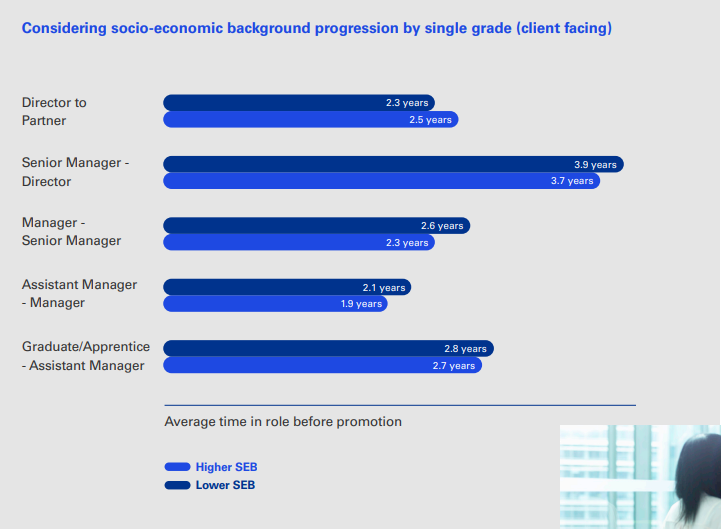

```{r include=FALSE}
library(tidyverse)
library(scales)
```

Career advancement is one way to measure inclusion in an organization. In a five-year study of its employees, KPMG found that socioeconomic background was the strongest determinant of progression, stronger than gender, ethnicity, disability, and sexual orientation. The pdf report is available [here](https://assets.kpmg/content/dam/kpmg/uk/pdf/2022/12/social-mobility-progression-report-2022-mind-the-gap-brochure.pdf). KPMG's largest socioeconomic gap was in the average time to progress from Manager to Senior Manager. Employees raised in lower socioeconomic conditions took 19% longer to advance. I screen captured the associated info-graphic below. You can get 19% from 2.6 and 2.3 if you presume rounding: 2.649 / 2.225 - 1 = 19%. That comes to about a five month gap (27 vs 22). KPMG measured almost no gap at the lowest grade transition (4%, 1 month). The Asst. Mgr. to Manager gap was 10%; Sr Manager to Director was 5%; and Director to Partner was *negative* 8%.

{width=600px}

You might wonder what constitutes low and high socioeconomic background. KPMG followed the guidance of the [Bridge Group and Social Mobility Commission in 2021](https://home.kpmg/uk/en/home/media/press-releases/2022/12/social-class-is-the-biggest-barrier-to-career-progression.html). If the occupation of the highest earner in your household when you were age 14 was in a professional or intermediate background, you have a higher socioeconomic background. If the occupation was manual or blue-collar, then you have a lower socioeconomic background.

I ran a simulation to estimate the effect of a persistent 19% promotion rate gap. Suppose you start a company and hire 100 people per month. Half of your hires have a lower socioeconomic background and half have a higher socioeconomic background. Each month employees have a probability of promoting equal to a normal distribution centered at either 2.225 years or 2.649 years, depending on socioeconomic background. I assumed a standard deviation of 6 months. In my simulation, employees leave the company after five years, so after five years headcount is steady at 100 hir/mo \* 12 mos/yr \* 5 yrs = 6,000 emps.

```{r echo=FALSE}
dat <- expand.grid(
  hir_mo = 1:120,
  hir_num_in_mo = 1:50,
  car_mo = 1:120
) %>%
  mutate(
    hir_id = factor(str_c(hir_mo, hir_num_in_mo, sep = "_")),
    mo = hir_mo + car_mo - 1
  ) %>%
  select(hir_id, hir_mo, car_mo, mo) %>%
  arrange(hir_id, hir_mo, car_mo)

dat$hsec_prob = pnorm(dat$car_mo, 2.225*12, .5*12)
dat$lsec_prob = pnorm(dat$car_mo, 2.649*12, .5*12)
dat <- dat %>%
  group_by(hir_id) %>%
  mutate(
    hsec_promo_ind = map_int(hsec_prob, ~rbinom(1, 1, .x)),
    hsec_promo_ind = if_else(cumsum(hsec_promo_ind) >= 1, 1, 0),
    lsec_promo_ind = map_int(lsec_prob, ~rbinom(1, 1, .x)),
    lsec_promo_ind = if_else(cumsum(lsec_promo_ind) >= 1, 1, 0)
  )
```

Here's what representation looks like over time. It's initially noisy, but converges toward a steady state of about 53% high socioeconomic background and 47% low socioeconomic background.

```{r echo=FALSE, warning=FALSE}
dat %>%
  # filter(car_mo <= 60) %>%
  filter(car_mo <= 60, mo <= 100) %>%
  group_by(mo) %>%
  summarize(
    n = n(),
    hsec_promo = sum(hsec_promo_ind),
    lsec_promo = sum(lsec_promo_ind),
    hsec_rep = hsec_promo / (lsec_promo + hsec_promo),
    lsec_rep = 1 - hsec_rep
  ) %>%
  select(-n) %>%
  pivot_longer(-mo, names_to = c("sec", "metric"), names_pattern = "(.*)_(.*)") %>%
  mutate(sec = if_else(sec == "lsec", "lower", "higher")) %>%
  filter(metric == "rep") %>%
  ggplot(aes(x = mo, y = value, color = sec)) + geom_line() +
  scale_y_continuous(labels = percent_format(1)) +
  labs(y = "representation", x = "month") +
  theme_light()
```

KPMG concludes this is evidence of bottlenecks into middle-management. This ideas is similar to the "broken rung" hypothesis posited by McKenzie & Company in 2019 ([pdf](https://www.mckinsey.com/~/media/McKinsey/Featured%20Insights/Gender%20Equality/Women%20in%20the%20Workplace%202019/Women-in-the-workplace-2019.ashx#:~:text=Source%3A%202019%20McKinsey%20%26%20Company%20and%20LeanIn.Org%20Women,%E2%80%9Cbroken%20rung%E2%80%9D%20is%20the%20key%20to%20achieving%20parity.)).

A few other ideas from the report:

- KPMG is addressing the challenge with programs designed to advance targeted groups into leadership roles.

- The issue is related to ideas about living wage and net disposable income.

- The issue is also related to ideas about marginalization of less-educated workers in the economy (see [this](https://www.richmondfed.org/publications/research/econ_focus/2021/q1/district_digest)).

- KPMG started a Social Mobility employee resource group. Most resource groups target biases directed toward groups marginalized by their physical appearance. Socioeconomic background is an exception.
