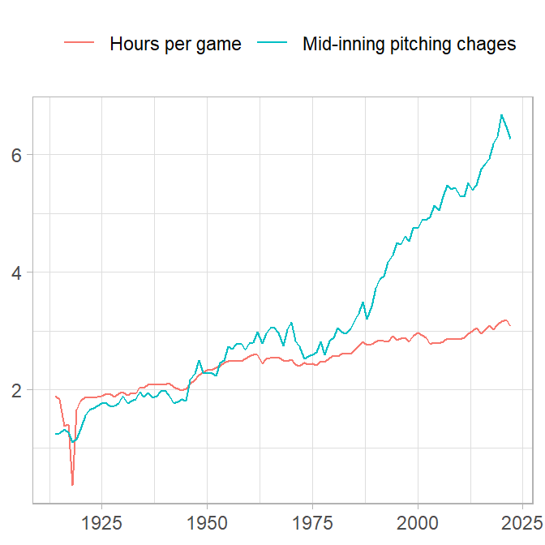
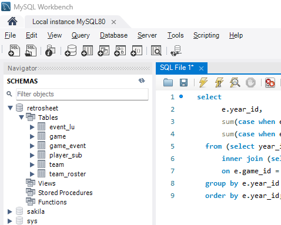
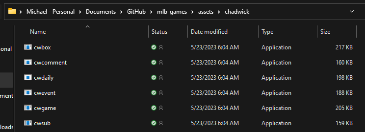
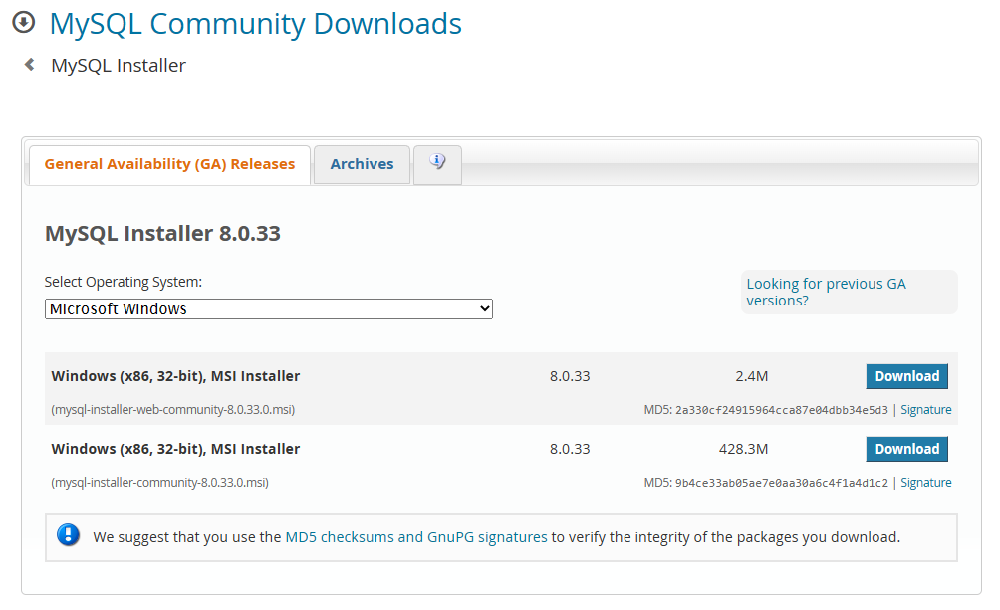
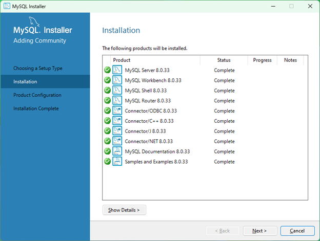

```{r include=FALSE}
library("tidyverse")
```

[Retrosheet](https://www.retrosheet.org/) is one of several sources of detailed baseball statistics.^[Others I've used are the Lahman database, the MLB API, and Baseball Reference.] It is unique in that it is the only one (that I know of) that curates play-by-play event files of games. Their event files reach back to 1914. Unlike other sources that summarize teams or games, these files summarize individual plays all the way down to pitch sequences. For example, I used my database to find out whether changing pitchers mid-inning is related to game duration. Might be!

```{r, echo=FALSE}

```

The downside is that the event files are not readily incorporated into a data analysis. There is quite a bit of work to transform the data. Mat Kovach published a database [here](https://www.pitcherlist.com/retrosheet-play-by-play-data-at-your-fingertips/), but I decided to build my own. These notes show you how to do it too. When you're done you will have a MySQL database with six tables:



- **game**. One row per game. Column defs [here](https://chadwick.readthedocs.io/en/latest/cwgame.html).
- **game_event**. One row per play. Column defs [here](https://chadwick.readthedocs.io/en/latest/cwevent.html)
- **player_sub**. One row per player substitution (pitch-hitters, pitching changes, etc.). Column defs [here](https://chadwick.readthedocs.io/en/latest/cwsub.html)
- **team_roster**, **team**, and **event_lu**. Look-up tables

# Software requirements

Retrosheet publishes regular season event files [here](https://www.retrosheet.org/game.htm). Each zipped season file contains game logs organized into a single file per home team. There are also look-up files for each team's roster. That's about 60 files per season that need to be transformed and combined. It's a lot of data. My Retrosheet database has 15 million rows and 160 columns. Plus there are tables summarizing games and player substitutions. It's way to much data to load into working memory, so it needs to live in a database. I installed a MySQL database and loaded it with an R script that runs a program named Chadwick.

**Chadwick**. The Retrosheet event files are ASCII text, but are not in a regular row-col format. Chadwick is a group of executable files that convert Retrosheet event files into a regular csv format which you can then upload into a database.

**MySQL**. The resources I relied on to learn how to build my database all used different databases (see References). I chose MySQL, a freely available, open-source database.

Okay, now that you know what you're in for, let's get started.

# Step 1: Install Chadwick

Chadwick is a collection of command-line utility programs that convert Retrosheet files from DiamondWare format to csv. The programs are written in C and compiled into binaries for distribution. 

Download **chadwick-0.10.0-win.zip** (or latest version for your OS) from [Chadwick GitHub repository](https://github.com/chadwickbureau/chadwick/releases), then extract the files. I unzipped mine into a subdirectory of my mlb-games repo since this is the only place I'll use it.^[I added `assets/chadwick/` to my .gitignore file though.]



That's all you need to do to install Chadwick unless you want to use Chadwick with the **baseballr** package as was done [here](https://billpetti.github.io/2019-08-10-build-retrosheet-event-roster-database-rstats-baseballr/).^[You can use the baseballr R package to download and process files, but it does not handle player substitutions. If you decide to go that route, you will have one other step. To make the programs visible to **baseballr**, add the directory to your path environment variable. From the Windows Start menu, search for _Path_. That pulls up the _System Properties_ panel. Click _Environment Variables_ and edit the _Path_ variable. Add your directory to the path list.] 

# Step 2: Install and configure MySQL

I recommend MySQL database because it is popular, easy to use, and it worked for me. However, there were a few steps.

    2.1. Install Microsoft Visual C++ runtime libraries
    2.2. Download and install MySQL
    2.3. Configure MySQL

**2.1. Install Microsoft Visual C++ runtime libraries**. MySQL requires Microsoft Visual C++ runtime libraries. I didn't have that, but with help from [this video](https://www.youtube.com/watch?v=w3PczJEiKpQ), I installed it from [Microsoft](https://learn.microsoft.com/en-us/cpp/windows/latest-supported-vc-redist?view=msvc-170). I won't repeat the instructions here - just follow the video.

**2.2. Download and install MySQL**. Go to [mysql.com](https://www.mysql.com) and click "Downloads" to download MySQL. Navigate to [MySQL Community (GPL) Downloads](https://dev.mysql.com/downloads/) > [MySQL Installer for Windows](https://dev.mysql.com/downloads/windows/). Download the desktop version (larger of the two downloads).

```{r, out.width = "750px", echo=FALSE}

```

Open the MySQL Installer and choose the Developer Default setup type. This will install the MySQL Server, Workbench front-end, and database connectors.



You can follow along with the [TechGraphs YouTube video](https://www.youtube.com/watch?v=qqLJm9wIuvw) starting at the 20 minute mark, but basically you are clicking "Next >" a bunch of times.^[This is one of two TechGraphs videos [posted here](https://techgraphs.fangraphs.com/tag/retrosheet/) that I reviewed for this post. They are from 2016, so some of what they do is no longer required (particularly, **baseballr** handles the part about downloading and parsing the Retrosheet files.)] You need to establish a database server password on the Accounts and Roles tab. This is a local database, so don't worry about security. I used "password".

**2.3. Configure MySQL**. By default, MySQL does not allow client applications like RStudio to insert data into the database. The issue seems to be related to the security risk of allowing a script to execute malicious code. You need to remove this restriction. In the comment section of [this stack exchange thread](https://dba.stackexchange.com/questions/48751/enabling-load-data-local-infile-in-mysql) are instructions. I edited my `mi.ini` file, located in the hidden ProgramData directory, and added three lines.

```{r, out.width = "750px", echo=FALSE}
knitr::include_graphics("images/myini.png")
```

# Step 3: Load the database with R

I originally did this with the [**baseballr**](https://billpetti.github.io/baseballr/) R package, but ran into a problem. The Chadwick programs accept command-line flags that customize the columns it includes in the data. I wanted the [extended column list](https://chadwick.readthedocs.io/en/latest/cwevent.html), and [player substitution table](https://chadwick.readthedocs.io/en/latest/cwsub.html), but **baseballr** doesn't seem to let you add the command-line flags. So I just wrote [my own script](https://github.com/mpfoley73/mlb-games/blob/main/src/01_get_retro_event_data.R). It's not really a big deal anyway. You can follow the link to GitHub, but I'm also pasting the code below so we can walk through it.

Start by loading the standard libraries. You'll need odbc to connect to your MySQL instance. I do not have a path variable for the Chadwick program, so instead I am just defining its directory in the code. I use `retro_yrs` to loop over each season, downloading and processing one season at a time. You might start with just one year or a couple as you test and tweak the code.

```{r eval=FALSE, echo=TRUE}
library(tidyverse)
library(odbc)
library(glue)
library(readxl)

chadwick_dir <- "C:\\Users\\mpfol\\OneDrive\\Documents\\GitHub\\mlb-games\\assets\\chadwick"
retro_yrs <- 1914:2022
wd <- getwd()
```

Above I captured my working directory, because I temporarily change it process the data. The next step is to download each season's zip file. The naming convention is [YYYY]eve.zip. Remember, there's about 60 files per zip, so you are going to have a massive amount of files after this step. This step took about 15 seconds per season, so a half hour total to download all seasons.

```{r eval=FALSE, echo=TRUE}
event_dir <- file.path(wd, "data/retrosheet/event")
setwd(event_dir)
for (season in retro_yrs) {
  zip_fn <- glue("{season}eve.zip")
  zip_path <- file.path(event_dir, zip_fn)
  download.file(url = glue("https://www.retrosheet.org/events/{zip_fn}"), 
                destfile = zip_path)
  unzip(zipfile = zip_path, exdir = event_dir)
  shell(glue("del {zip_fn}"))
}
```

Now run Chadwick to convert each seasons 60 or so files into three csv files you can upload into a database.

- **event[YYYY].csv**. This is the big one - one row per game event. Column defs [here](https://chadwick.readthedocs.io/en/latest/cwevent.html).
- **sub[YYYY].csv**. Player substitution detail - one row per substitution. Column defs [here](https://chadwick.readthedocs.io/en/latest/cwsub.html)
- **game[YYYY].csv**. Game summaries - one row per game. Column defs [here](https://chadwick.readthedocs.io/en/latest/cwgame.html)

The code below also formats a couple files into csv for upload.

- **roster[YYYY].csv**. Team roster look-up table - one row per season/team/player.
- **team[YYYY].csv**. Team look-up table - one row per season/team.

The documentation in the above links also explains how you set the flags in the command-line calls. When this step is done, those 60 files per season will be gone, and instead you'll have five files per season.

```{r eval=FALSE, echo=TRUE}
setwd(event_dir)
roster_col_names <- c("PLAYER_ID", "LAST_NAME", "FIRST_NAME", "BATS", "THROWS", 
                      "TEAM_ID", "POS")
roster_col_types <- str_c("ccccccc")
team_col_names <- c("TEAM_ID", "LEAGUE_ID", "TEAM_CITY", "TEAM_NAME")
team_col_types <- c("cccc")
for (season in retro_yrs) {
  # Create event[YYYY].csv.
  cwevent_cmd <- glue("{file.path(chadwick_dir, 'cwevent')} -y {season} -f 0-96 ",
                      "-x 0-60 -q -n {season}*.EV* > event{season}.csv")
  shell(cwevent_cmd)
  # Create sub[YYYY].csv.
  cwsub_cmd <- glue("{file.path(chadwick_dir, 'cwsub')} -y {season} -q -n ",
                    "{season}*.EV* > sub{season}.csv")
  shell(cwsub_cmd)
  # Create game[YYYY].csv.
  cwgame_cmd <- glue("{file.path(chadwick_dir, 'cwgame')} -y {season} -f 0-83 -x",
                     "0-96 -q -n {season}*.EV* > game{season}.csv")
  shell(cwgame_cmd)
  # Create roster[YYYY].csv from individual team files. File names are like 
  # CLE1973.ROS, one for each team.
  roster_fn <- list.files(pattern = glue("\\.*{season}\\.ROS$"))
  roster_df <- map_df(roster_fn, ~read_csv(., col_names = roster_col_names, 
                                           col_types = roster_col_types))
  data.table::fwrite(roster_df, glue("roster{season}.csv"))
  # Create team[YYYY].csv from TEAM[YYYY]. 
  team_fn <- glue("TEAM{season}")
  team_df <- read_csv(team_fn, col_names = team_col_names, col_types = team_col_types)
  data.table::fwrite(team_df, glue("team{season}.csv"))
  # Clean up
  shell(glue("del {season}*.EV*"))
  shell(glue("del *{season}.ROS"))
  shell(glue("del TEAM{season}"))
}
```

Now we're ready to insert the csv files into the SQL Server database. I probably should have incorporated the database loading code into the loop above. That would have avoid writing the files to csv, then turning around and reading them back in. I did it this way mostly because I was solving one problem at a time. 

The database connection object is pretty standard. I don't think you would need to change anything, unless you chose a differnt user or password.

```{r eval=FALSE, echo=TRUE}
setwd(event_dir)
retrosheet_conn <- dbConnect(
  RMySQL::MySQL(),
  dbname = "retrosheet",
  host = "localhost",
  port = 3306,
  user = "root",
  password = "password" 
)
event_col_types <- str_c(
  "ccdddddcddcccccccccccccccccccclldddlldlldlldlldcll",
  "cddcdcdcdddddccclllllllllccclllllccccdddddddddd", # 97 standard fields
  "cccdlldddddllddllcclldddddddddcccdddddddddddddclllldddddddddd" # 61 extended fields
)
sub_col_types <- str_c("cddcdddcdd")
game_col_types <- str_c(
  "cddcdlcccccccccclldcccclddddddddddddddddddccclcdcd",
  "cdcdcdcdcdcdcdcdcdcdcdcdcdcdcdcdcccclldlllccdddddd",
  "ddddddddddddddddddddddddddddddddddddddddddddllllll",
  "llllccccccccccccccccccccccclldl"
)
for (season in retro_yrs) {
  event_df  <- read_csv(glue("event{season}.csv"),  col_types = event_col_types)
  sub_df    <- read_csv(glue("sub{season}.csv"),    col_types = sub_col_types)
  game_df   <- read_csv(glue("game{season}.csv"),   col_types = game_col_types)
  roster_df <- read_csv(glue("roster{season}.csv"), col_types = roster_col_types)
  team_df   <- read_csv(glue("team{season}.csv"),   col_types = team_col_types)
  # Add year_id col and change column name case to lower.
  event_df  <- event_df  %>% janitor::clean_names("snake") %>% 
    mutate(year_id = season) %>% select(game_id, event_id, year_id, everything())
  sub_df    <- sub_df    %>% janitor::clean_names("snake") %>% 
    mutate(year_id = season) %>% select(game_id, event_id, year_id, everything())
  game_df   <- game_df   %>% janitor::clean_names("snake") %>% 
    mutate(year_id = season) %>% select(game_id, year_id, everything())
  roster_df <- roster_df %>% janitor::clean_names("snake") %>% 
    mutate(year_id = season) %>% select(team_id, year_id, player_id, everything())
  team_df   <- team_df   %>% janitor::clean_names("snake") %>% 
    mutate(year_id = season) %>% select(team_id, year_id, everything())
  # Write to db
  dbWriteTable(retrosheet_conn, "game_event",  event_df,  append = TRUE, 
               overwrite = FALSE, row.names = FALSE)
  dbWriteTable(retrosheet_conn, "player_sub",  sub_df,    append = TRUE, 
               overwrite = FALSE, row.names = FALSE)
  dbWriteTable(retrosheet_conn, "game",        game_df,   append = TRUE, 
               overwrite = FALSE, row.names = FALSE)
  dbWriteTable(retrosheet_conn, "team_roster", roster_df, append = TRUE, 
               overwrite = FALSE, row.names = FALSE)
  dbWriteTable(retrosheet_conn, "team",        team_df,   append = TRUE, 
               overwrite = FALSE, row.names = FALSE)
  print(glue("{season}: {scales::comma(nrow(event_df), 1)} event, ",
             "{scales::comma(nrow(sub_df), 1)} sub, ",
             "{scales::comma(nrow(roster_df), 1)} roster, ",
             "{scales::comma(nrow(game_df), 1)} game, ",
             "{scales::comma(nrow(team_df), 1)} team."))
  shell(glue("del event{season}.csv"))
  shell(glue("del sub{season}.csv"))
  shell(glue("del game{season}.csv"))
  shell(glue("del roster{season}.csv"))
  shell(glue("del team{season}.csv"))
}

setwd(wd)
```

There is one more step. I noticed a couple data issues that I fixed. Then I created some indexes for performance, following the lead from [Bill Petti's post](https://billpetti.github.io/2019-08-10-build-retrosheet-event-roster-database-rstats-baseballr/). I also added an event lookup table. I copied the "Event type code (field 34)" table from the [Chadwick documentation](https://chadwick.readthedocs.io/en/latest/cwevent.html) into Excel, then loaded it.

```{r eval=FALSE, echo=TRUE}
dbSendStatement(retrosheet_conn, "update game set minutes_game_ct = NULL where minutes_game_ct = 0")
dbSendStatement(retrosheet_conn, "update game set attend_park_ct  = NULL where attend_park_ct  = 0")
# Add lookups. Got this from https://chadwick.readthedocs.io/en/latest/cwevent.html.
lu_df <- read_xlsx(file.path(event_dir, "code_lookup.xlsx"))
colnames(lu_df) <- c("event_cd", "event_tx")
dbWriteTable(retrosheet_conn, "event_lu",  lu_df, overwrite = TRUE, append = FALSE, row.names = FALSE)
# Create indexes per recommendation from
# https://billpetti.github.io/2019-08-10-build-retrosheet-event-roster-database-rstats-baseballr/
dbSendStatement(retrosheet_conn, "alter table game add primary key (game_id(12))")
dbSendStatement(retrosheet_conn, "alter table game_event add primary key (game_id(12), event_id)")
dbSendStatement(retrosheet_conn, "alter table team add primary key (team_id(3), year_id)")
# Problem with team_roster PK: dup record.
dbSendStatement(retrosheet_conn, "delete from team_roster where team_id = 'OAK' and year_id = 2006 and player_id = 'kigem001' and pos = 'X'")
dbSendStatement(retrosheet_conn, "alter table team_roster add primary key (team_id(3), year_id, player_id(8))")
# (no unique key for player_sub)
dbSendStatement(retrosheet_conn, "create index sub_game_event on player_sub (game_id(12), event_id)")
dbSendStatement(retrosheet_conn, "alter table event_lu add primary key (event_cd)")
# Other indexes for performance
dbSendStatement(retrosheet_conn, 'create index game_year on game (year_id)')
dbSendStatement(retrosheet_conn, 'create index event_year on game_event (year_id)')
dbSendStatement(retrosheet_conn, 'create index roster_year on team_roster (year_id)')
dbSendStatement(retrosheet_conn, 'create index sub_year on player_sub (year_id)')
dbSendStatement(retrosheet_conn, 'create index team_year on team (year_id)')
dbSendStatement(retrosheet_conn, 'create index event_game_id on game_event (game_id(12))')
dbSendStatement(retrosheet_conn, 'create index event_home_team_id on game_event (home_team_id(5))')
dbSendStatement(retrosheet_conn, 'create index event_away_team_id on game_event (away_team_id(5))')
dbSendStatement(retrosheet_conn, 'create index event_event_cd on game_event (event_cd)')
```

<br>

# Conclusion: Using MySQL

That's it. Now that you have your Retrosheet database, you can query it from R to feed your analysis. Here's how I created that plot at the top of this post.

```{r eval=FALSE, echo=TRUE}
library(odbc)
library(tidyverse)

retrosheet_conn <- dbConnect(
  RMySQL::MySQL(),
  dbname = "retrosheet",
  host = "localhost",
  port = 3306,
  user = "root",
  password = "password" 
)

pitcher_chgs <- dbGetQuery(
  retrosheet_conn,
  "select 
	  e.year_id, 
	  sum(case when e.inn_pa_ct > 0 then 1 else 0 end) as mid_inn_chgs 
  from (select year_id, game_id, event_id, inn_pa_ct from retrosheet.game_event) e
	  inner join (select game_id, event_id from retrosheet.player_sub where removed_fld_cd = 1) s   
      on e.game_id = s.game_id and e.event_id = s.event_id 
  group by e.year_id 
  order by e.year_id"
)

innings <- dbGetQuery(
  retrosheet_conn,
  "select year_id, sum(inn_ct) innings, sum(minutes_game_ct) mins from game group by year_id"
)

inner_join(pitcher_chgs, innings, by = join_by(year_id)) %>%
  mutate(
    `Mid-inning pitching chages` = mid_inn_chgs / innings * 9,
    `Hours per game` = mins / 60 / innings * 9
  ) %>%
  pivot_longer(cols = c(`Mid-inning pitching chages`, `Hours per game`)) %>%
  ggplot(aes(x = year_id, y = value, color = name)) + geom_line() +
  theme_light() +
  theme(legend.position = "top") +
  labs(x = NULL, y = NULL, color = NULL)
```

```{r, echo=FALSE}

```

# References

I mainly relied on the two sources below to set up my Retrosheet event database and prepare this tutorial.

TechGraphs posted a [two-part video series](https://techgraphs.fangraphs.com/tag/retrosheet/) on YouTube in 2016. Some steps differ from what I've done, but there are lots of insights peppered throughout that will make you more comfortable with the whole process.

Bill Petti posted [this article](https://billpetti.github.io/2019-08-10-build-retrosheet-event-roster-database-rstats-baseballr/) in 2019. The baseballr R package replaces some of the work from 2016. The post leaves out some set-up steps related to the Chadwick software and database installation.

[This post](https://www.pitcherlist.com/retrosheet-play-by-play-data-at-your-fingertips/) by Matt Kovach talks about the value of a Retrosheet database and explains how you might use it. Matt doesn't explain how to build the database, but it's a good overview of why you might want to create one.

Chadwick's [documentation](https://chadwick.readthedocs.io/en/latest/index.html). 

MySQL [documentation](https://dev.mysql.com/doc/refman/8.0/en/option-files.html) about setting options.
