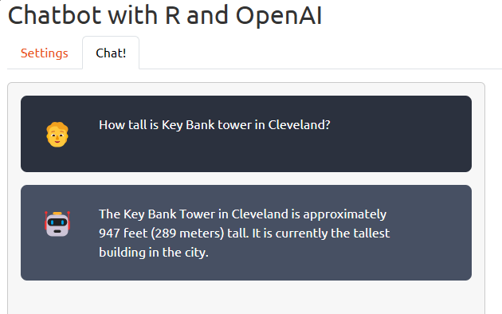
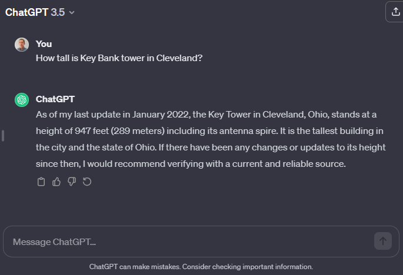
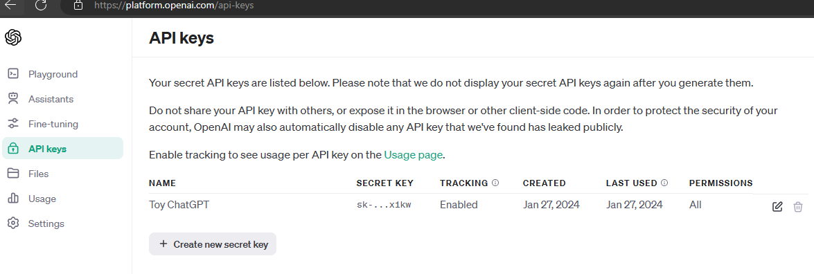
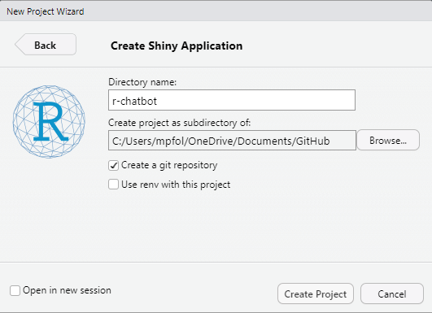
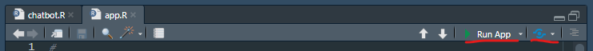

I created a chatbot in Shiny by coding along with [James Wade's](https://www.youtube.com/@james-h-wade) three-part YouTube tutorial series ([#1](https://www.youtube.com/watch?v=d7l4EZYlZE0), [#2](https://www.youtube.com/watch?v=agPFcEeQSEQ), and [#3](https://www.youtube.com/watch?v=odBkUdWlwUk)), and added ideas I learned from Alejandro AO's [embedding tutorial](https://www.youtube.com/watch?v=dXxQ0LR-3Hg) in python. 



You can try it out on [shinyapps.io](https://mpfoley73.shinyapps.io/R-Chatbot/). Unfortunately, the OpenAI API service is not free. I pay a fraction of a penny for every call to it, but the pennies add up. I made the API key a setting the user must enter. If you don't already have an OpenAI key, you can sign up at [OpenAI](https://openai.com/pricing). More on that below.

This was my first Shiny project and first LLM project, so this tutorial is truly novice level. I'll highlight important code chunks, but you can find the raw source code on [GitHub](https://github.com/mpfoley73/r-chatbot). There are three hurdles to get your chatbot up and running: i) interface with an API using **httr2**, in particular, ii) OpenAI's ChatGPT API, and iii) create Shiny web app. Let's go through this slowly, starting with OpenAI and ChatGPT

## OpenAI and ChatGPT

OpenAI is an artificial intelligence research organization that has released several large language models (LLMs), including GPT-3 (2020), 3.5 (2022), and 4 (2023). The models have variants that differ in their complexity and cost.^[Neoteric posted a nice overview [here](https://neoteric.eu/blog/gpt-4-vs-gpt-3-openai-models-comparison/#:~:text=GPT%2D3%20is%20a%20language,its%20remarkable%20language%20generation%20capabilities.).]. `gpt-3.5-turbo` is currently much cheaper than the new `gpt-4`. Also be aware of `text-embedding-ada-002`, used for processing your data into a form you can use for your own ML algorithms.



You are probably already familiar with the ChatGPT web interface to the GPT models at https://chat.openai.com. Once you can create an account, the free plan lets you access `gpt-3.5-turbo`.^[The `gpt-4` model is available for $20/month.] I use the web interface to write code, summarize technical text, and and get answers to questions I used to pose to Google. OpenAI's API exposes the same models for you to employ in your programs and web applications.

Using your same OpenAI credentials, log in at https://platform.openai.com/, then go to **Settings > Billing** to purchase credits. The credits are deducted for each call to the API. Most messages I've posted to the API cost less than a penny, but it depends on the complexity of the task and the model you access, so take a look at their [pricing page](https://openai.com/pricing) for details. \$20 of credits would have been plenty for me to do this project, except I started experimenting with the expensive newer models and ran through my credit balance and had to purchase more.



Now that you have some credits to spend, create your API key. The API key is your authentication mechanism to interact with the API. Keep it private - don't embed it in your code, save it to GitHub, or put it anywhere someone can find and drain your credit balance. I saved my key to a .Renviron file in my R project, then added .Renviron to my .gitignore file so GitHub does not track it and no one can see it. I'll explain that in the next section. Let's create the key. Go to API keys in the left side menu and click "+ Create a new secret key". You only need one, but I can imagine creating a separate key for each project you build so you can track usage. I called mine "Toy ChatGPT". That's all there is to it. Keep the key value handy so you can put it into the chatbot we're about to make. Otherwise, we're done at OpenAI. Let's jump into R Studio and create the Shiny app.

## Create a Shiny App Project in R Studio



With API key in hand, we're ready to create the chatbot project in RStudio. In R Studio, open **File > New Project > New Directory > Shiny Application**. I named my project "r-chatbot". 

Now that we have a project, let's save the API key to a file. From the RStudio console, create a project-level .Renviron file using the **usethis** package: `usethis::edit_r_environ(scope = "project")` pulls up and editor for your project-level .Renviron file. I set a value for `OPENAI_API_KEY` (which I've redacted for this post) and another called `FOLEY_KEY` (which I also redacted). This way, I can let the user enter their own API key instead of using up my precious credits. The value for `FOLEY_KEY` is something simple and memorable. When I use my chatbot, I can enter my `FOLEY_KEY` value and my app will translate it into the `OPENAI_API_KEY`, so I don't have to manually look it up.

```{r eval=FALSE}
OPENAI_API_KEY="XXXXXXXXXXXXXXXXXXXXXXXXXXXXXXXXXXXXXXXXXXXXXXXXXXXXXXX"
FOLEY_KEY="XXXXX"
```

W also need to add this file to .gitignore. I used the preconfigured .ignore from the R project. Key line is here:

```{r eval=FALSE}
# R Environment Variables
.Renviron
```

## The App

I'll keep the focus on the OpenAI ApI integration rather than on the fundamentals of Shiny app development, especially since I am the last person to be giving pointers on Shiny. But hey, I got my app running, so let's capture at least the minimum of what you need to know to get this off the ground.

I followed along with James Wade's videos to get my bot running. You should probably do the same. Then I circled back and read _some_ of Hadley Wickham's [Mastering Shiny](https://mastering-shiny.org/) to better understand what I just did. Then I changed my original code to experiment with what I just learned. 

Notice two files in my GitHub project directory: [app.R](https://github.com/mpfoley73/r-chatbot/blob/main/app.R) contains the framework for the app, and while it is not strictly required that you call it app.R, that is the convention and the default name shinyapps.io uses; chatbot.r contains the code specific to our bot logic. Let's take a quick tour of app.R.

There are three components to app.R. The first is an object, usually named `ui`, that defines the screen layout. James Wade uses `page_sidebar()` to create the object, but the basic way to do it is with `fluidPage()`, so that's what I stuck with. I pass in some settings inputs first, and then the important part is the call to `tabsetPanel()` which creates a tabset like in Rmarkdown. The two tabs, Settings and Chat!, are defined by `tabPanel()`. The `wellPanel()` call will hold the chat history in an area of fixed dimensions with a scrollbar. The last thing to note is that each of the inputs and outputs functions start with a string label that becomes the input handle to access its values. E.g., values entered into the textbox defined by `textAreaInput("user_content", ...)` can then be referenced as `input$user_content`.

```{r eval=FALSE}
ui <- fluidPage(
  tags$head(
    tags$link(rel = "stylesheet", type = "text/css", href = "chat_style.css")
  ),
  titlePanel("Chatbot with R and OpenAI"),
  theme = bs_theme(bootswatch = "united"),
  tabsetPanel(
    tabPanel(
      "Settings",
      p(""),
      textInput("api_key", label = "API Key"),
      selectInput("model", label = "Model", choices = c("gpt-3.5-turbo", "gpt-4")),
      selectInput("task", label = "Task", choices = c("general", "code"))
    ),
    tabPanel(
      "Chat!",
      p(""),
      wellPanel(
        style = "height: 400px; width: 600px; overflow-y: auto;",
        uiOutput("chat_history")
      ),
      p(""),
      textAreaInput("user_content", label = NULL, width = "600",
                     placeholder = "Enter your message..."),
      actionButton("chat", label = NULL, icon = icon("paper-plane"),
                   width = "80px",
                   class = "m-2 btn-secondary")
    )
  )
)
```

The second component to app.R is a function definition named `server()`. It defines how the input and output objects interact. They key lines are the calls to `chat()` and `update_history()`. `chat()` passes the submitted prompt along with the conversation history into the OpenAI API. `update_history()` appends the OpenAI response to the conversation history.

```{r eval=FALSE}
server <- function(input, output) {
  chat_history <- reactiveVal()
  # Wrap the server logic in observe() attached to the actionButton with
  # bindEvent().
  observe({
    # Require that the user has typed something into the textbox. If the user
    # clicks the action button with empty user_content, nothing happens.
    req(input$user_content != "")
    response <- chat(
      user_content = input$user_content,
      chat_history = chat_history(),
      chat_model = input$model,
      chat_task = input$task,
      api_key = input$api_key
    )
    # chat_history is a reactive value. To update date it, pipe the updated
    # history into it as if it were a function.
    update_history(chat_history(), input$user_content, response) |> chat_history()
    # Write to the `chat_history` uiOutput
    output$chat_history <- renderUI(map(chat_history(), \(x) markdown(glue("{x$content}"))))
  }) |> bindEvent(input$chat)
}
```

The last component is simply a call to `shinyApp()`.

```{r eval=FALSE}
shinyApp(ui = ui, server = server)
```

## The Bot

The logic to interface with OpenAI is surprisingly simple. chatbot.R contains all the logic. My `chat()` function assembles the system prompt, chat history, and the user prompt into a new message for the API. The system prompt sets the context for the user's message. It can be anything, but the idea is to have a repeatable text block that always gets passed in so the user doesn't have to set the context. My system prompt depends on the value of the `input$task` element. The call to the API is a single statement. It's long, but not difficult. All of these `req...()` functions are from the **httr2** package. The first two set the API endpoint. Then the API token and other identifying information is attached. `req_body_json()` attaches the message. It takes a single argument, `data` that is a list of lists. This part is specific to the API, so you just have to go through their documentation or copy someone else's code like I did (James Wade). The `req_retry()` and `req_throttle()` define out network and server issues are handled, and `req_perform()` sends it off. Notice `req_dry_run()` commented out - it's a good diagnostic tool to show you waht `req_perform()` is about to send.

```{r eval=FALSE}
resp <-
  request("https://api.openai.com/v1") |>
  req_url_path_append("chat/completions") |>
  req_auth_bearer_token(token = api_key) |>
  req_headers("Content-Type" = "application/json") |>
  req_user_agent("Mike Foley @mpfoley73 | Toy Project") |>
  req_body_json(data = list(model = chat_model, messages = chat_messages)) |>
  req_retry(max_tries = 4) |>
  req_throttle(rate = 15) |>
  # httr2::req_dry_run()
  req_perform()
```

The next two lines of code handle the response from OpenAI. Again, you have to consult the documentation to learn where the actual content is.

```{r eval=FALSE}
openai_chat_response <- resp |> resp_body_json(simplifyVector = TRUE)

openai_chat_response$choices$message$content
```

The last part of chatbot.R updates the history by concatenating the existing history with the new response from OpenAI.

```{r eval=FALSE}
update_history <- function(chat_history, user_content, response) {
  c(chat_history,
    list(
      list(role = "user", content = str_replace(user_template, "MESSAGE_TEXT", user_content)),
      list(role = "assistant", content = str_replace(bot_template, "MESSAGE_TEXT", response))
    )) |>
    purrr::compact()
}
```

With app.R and chatbot.R defined, you can run the Shiny app by clicking the Run App button in the panel header. Assuming you are happy with it, click the blue Publish button to its right  to publish the app to shinyapps.io.



[My final chatbot](https://mpfoley73.shinyapps.io/R-Chatbot/) includes avatars for the bot and the user. Adding bells and whistles is a good way to deepen your understanding.

```{css, echo=FALSE}
img {
  width: 67%;
  float: right;
  padding: 5px 0px 15px 15px;
}
pre.r {
  color: #cccccc;
  background: #444444;
}
```

