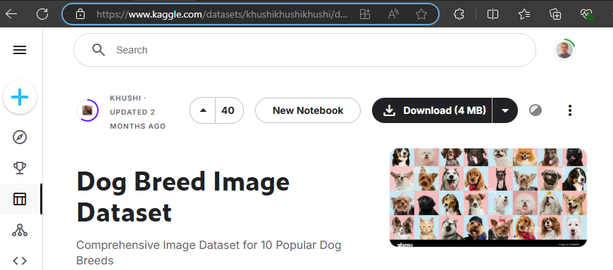
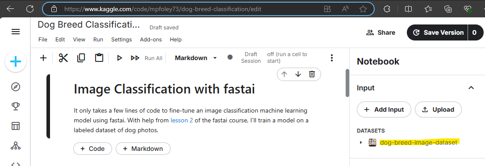

<style>
    img:hover {
        transform: scale(1.05);
    }
</style>

Today I fine tuned an image recognition deep learning model, created a web interface with Gradio, and deployed it on Hugging Face Spaces. This project was the subject of lesson 2 of fast.ai's [Deep Learning for Coders](https://course.fast.ai/) course.

## 1. Fine-tuning a Model in Kaggle

Deep learning models need to train on a GPU (Graphics Processing Unit) because CPUs are too slow. I followed fast.ai's recommendation to use Kaggle (Google Colab, AWS, and Microsoft Azure) are popular alternatives. Kaggle was particularly convenient because I was able to find a curated dataset there. After logging into Kaggle, I searched for "dog breed image" and came across [this one](https://www.kaggle.com/datasets/khushikhushikhushi/dog-breed-image-dataset) posted by Khushi. I clicked "New Notebook" to create a project with the data already loaded into the environment.



It's in the Input > Datasets section of [my notebook](https://www.kaggle.com/code/mpfoley73/dog-breed-classification). The full path is `/kaggle/input/dog-breed-image-dataset`.



My notebook follows [chapter 2](https://github.com/fastai/fastbook/blob/master/02_production.ipynb) of the fast.ai book. My notebook is self-documented, so I won't step through each cell. But the upshot is that fast.ai provides a super-convenient framework for fitting a model. There is not much code in my notebook. Here are the highlights though:

Using fast.ai's `DataBlock()` method, I created a DataLoader object that defines how manage the data: how it is structured, how to create the train/test split, any required transformations, etc. I used the object to load the dog breed data set, then passed it into `vision_learner()` to create a learner object and fine tune a ResNet-18 model on the data with `fine_tune()`. The model can then predict on new images using the `predict()` method. Now that the model was fine-tuned, I exported it to a pickle file with the `export()` method. I downloaded the pickle file from Kaggle to my laptop.

```
from fastai.vision.all import *

parent_dir = '/kaggle/input/dog-breed-image-dataset/dataset'

dogs = DataBlock(
    blocks=(ImageBlock, CategoryBlock), 
    get_items=get_image_files, 
    splitter=RandomSplitter(valid_pct=0.2, seed=42),
    get_y=parent_label,
    item_tfms=[RandomResizedCrop(224, min_scale=0.5)],
    batch_tfms=aug_transforms()
)

dls = dogs.dataloaders(parent_dir)

learn = vision_learner(dls, resnet18, metrics=error_rate)

learn.fine_tune(4)

learn.predict('/kaggle/input/dog-breed-image-dataset/dataset/Beagle/Beagle_1.jpg')

learn.export('dog_breed_classifier.pkl')
```

## 2. From Notebook to App with Gradio

Gradio is a Python library that allows you to quickly create user-friendly web interfaces for machine learning models. You can create an interface in just a few lines of code. Tanishq Abraham posted [an article](https://www.tanishq.ai/blog/posts/2021-11-16-gradio-huggingface.html) walking through the steps. Here is my experience.

I created a folder on my laptop and copied in the pickle file I had downloaded. I also grabbed a photo of Chester to use as an example.

I opened VS Code and created a new file named app.py. The full file is on [Hugging Face](https://huggingface.co/spaces/mpfoley73/fastai_dog_breed_classifier/blob/main/app.py), but here is the stripped down code:

```
import gradio as gr
from fastai.vision.all import *
import skimage
import pathlib

# Uncomment this for local (Windows) development.
# Reference: https://stackoverflow.com/questions/57286486/i-cant-load-my-model-because-i-cant-put-a-posixpath
#
# posix_backup = pathlib.PosixPath
# try:
#     pathlib.PosixPath = pathlib.WindowsPath
#     learn = load_learner('dog_breed_classifier.pkl')
# finally:
#     pathlib.PosixPath = posix_backup
#
# Uncomment this for Hugging Face
learn = load_learner('dog_breed_classifier.pkl')

labels = learn.dls.vocab
def predict(img):
    img = PILImage.create(img)
    pred,pred_idx,probs = learn.predict(img)
    return {labels[i]: float(probs[i]) for i in range(len(labels))}

title = "Dog Breed Classifier"
description = "A dog breed classifier trained on the Dog Breed dataset with fastai. Created as a demo for Gradio and HuggingFace Spaces."
article="<p style='text-align: center'><a href='https://mpfoley73.netlify.app/post/2024-07-21-deploying-a-deep-learning-model/' target='_blank'>Blog post</a></p>"
examples = ['chester_14.jpg']

gr.Interface(
    fn=predict,
    inputs=gr.Image(),
    outputs=gr.Label(),
    title=title,
    description=description,
    article=article,
    examples=examples
).launch()
```

If you compare my code to Tanishq's blog, you will notice some small differences related to changes in the `gradio` library. Also, notice the comment block that reconciles the path differences between Hugging Face and my laptop. When you run the script, you get a notification in the terminal like this:

```
PS C:\Users\mpfol\OneDrive\Documents\GitHub\fastai_dog_breed_classifier> & C:/Users/mpfol/AppData/Local/Microsoft/WindowsApps/python3.11.exe c:/Users/mpfol/OneDrive/Documents/GitHub/fastai_dog_breed_classifier/app.py
Running on local URL:  http://127.0.0.1:7860

To create a public link, set `share=True` in `launch()`.
```

VS Code has spawned a local web site to run the app. Open the link!


## 3. From Local App to Hugging Face

The last step is to publish the app to Hugging Face Spaces so that it is publicly viewable. Continuing with Tanishq's tutorial, I created an account at Hugging Face, then created a new Space. This is essentially a git repository on Hugging Face. I called my space `fastai_dog_breed_classifier`.

In VS Code, I opened the Terminal and changed directory into by GitHub repos area. Then I cloned the repo.

```
PS C:\Users\mpfol\OneDrive\Documents\GitHub> git clone https://huggingface.co/spaces/mpfoley73/fastai_dog_breed_classifier  
```

The Hugging Face [Getting Started with Repositories](https://huggingface.co/docs/hub/repositories-getting-started#terminal) article explains that you need `git-lfs` for large files like our pickle file.

```
PS C:\Users\mpfol\OneDrive\Documents\GitHub> git lfs install
```

I copied my `app.py`, the pickle file, and Chester's photo into my local GitHub directory. Then I committed the whole thing and pushed it up to Hugging Face.

```
PS C:\Users\mpfol\OneDrive\Documents\GitHub\fastai_dog_breed_classifier> git commit -am "initial commit"
PS C:\Users\mpfol\OneDrive\Documents\GitHub\fastai_dog_breed_classifier> git push
```

The Hugging Face repo is [here](https://huggingface.co/spaces/mpfoley73/fastai_dog_breed_classifier/tree/main). After pushing the commit, Hugging Face immediately began deploying my app [here](https://huggingface.co/spaces/mpfoley73/fastai_dog_breed_classifier).

And that was all I needed to do!

*A final note: this actually took me over 10 hours spread over a few weeks. Almost nothing worked right without a lot of time and hair pulling. My notes make it seem simple, but it's only simple after you're done. Thank you, fastai, and Tanishq, and the other online resources!*
