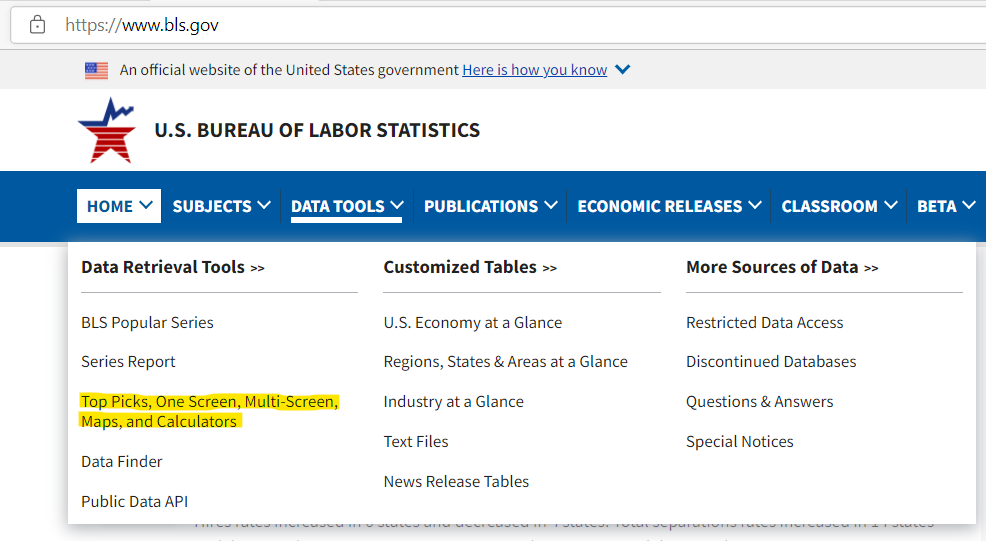

```{r setup, include=FALSE}
knitr::opts_chunk$set(echo = TRUE)
```

The Ohio Department of Job and Family Services (ODJFS) announced [Ohio’s unemployment rate fell to 5.1% in October](https://jfs.ohio.gov/RELEASES/unemp/202111/index.stm). It was 5.3% in September, so that's good news. The unemployment rate is a tricky concept because it combines counts of three employment statuses: *employed*, *unemployed*, and *not in the labor force*. The ODJFS also reports many related statistics in their monthly releases. Data journalists like Rich Exner at cleveland.com distill the bewildering mass of statistics into something comprehensible to the general public. E.g., [this one](https://www.cleveland.com/open/2021/03/ohio-loses-jobs-8400-jobs-in-february-remains-below-pre-pandemic-levels.html) from Mar 2021 boils the data down to a couple nice plots. 

Let's construct our own report. Below I show how to pull the raw data from the Bureau of Labor Service (BLS), the originator of employment data. I pull the data dynamically using their web API. Then I construct a simple viz using **ggplot**, and make it interactive with **ggplotly**. That enables me to tell my own story with the data.

# Employment Data on BLS

The BLS compiles employment data and makes it available with several data tools. Here is how I found Ohio's data:

Go to [www.bls.gov](https://www.bls.gov/). On the top menu bar, select DATA TOOLS > Top Picks.... 



That takes you [here](https://www.bls.gov/data/). Scroll down to the **Unemployment** section. We want the Local Area Unemployment Statistics (LAUS). Select the Top Picks icon.


That takes you [here](https://data.bls.gov/cgi-bin/surveymost?la) and on this page you can click on [Ohio](https://data.bls.gov/cgi-bin/surveymost?la+39). Almost there. The next web page presents a menu of data series. The one we want is the *Ohio, seasonally adjusted*, which is composed of six data series.


Finally, here's our report. We can change the dates and export to Excel or csv. 


Each of those columns is separate data series:

* **LASST390000000000003**: Ohio, seasonally adjusted, unemployment rate
* **LASST390000000000004**: # Ohio, seasonally adjusted, unemployment
* **LASST390000000000005**: # Ohio, seasonally adjusted, employment
* **LASST390000000000006**: # Ohio, seasonally adjusted, labor force
* **LASST390000000000007**: # Ohio, seasonally adjusted, employment-population ratio
* **LASST390000000000008**: # Ohio, seasonally adjusted, labor force participation rate	

Those data series identifiers are what I'm really after. I can use them to pull data from arbitrary date ranges programmatically from the BLS's web API. I don't want to always go through this process to get BLS data, but I don't know a better way to identify exactly what it is I want. 

# Pull Data from the BLS API

Now that I know what I want, I'd rather pull this automatically if I'm going to be updating this report again in down the road. The BLS has a public API for this. There is a full explanation on their [main page](https://www.bls.gov/developers/home.htm). I'm in no position to give a tutorial, but I can at least show you what I learned to get it to work for me.

First thing to know is that there are two versions of the API, V1 and V2. V1 lets you pull one data series at a time, with no custom dates, and you can only pull data a few times per day. V2 has no limitations like that, but it does require you to [register for an API token](https://data.bls.gov/registrationEngine/), a long series of letters and numbers that is basically your API password. *Register for the token*. It costs you nothing and takes only two minutes. BLS emails you your token right away. You pass the token as a function parameter when you request data from the API. Don't paste the token into your R program though. Anyone can see it and... I dunno, run amok pulling data from BLS. Instead, set it in your project **.Renviron** file. In your RStudio console, type

`usethis::edit_r_environ(scope = "project")`

Then assign a variable name. Call it anything you want; I called mine `BLS_API_TOKEN`.

`BLS_API_TOKEN=abc123...`

where `abc123...` is your token string. The second thing to know is that the API supports GET and POST. If you intend to request a single series, you can use the GET method, and that appears to involve less coding than POST. But we need POST because we are pulling dix data series at once. POST seems like the more flexible way to go, so now that I have it working, I'll probably never look at GET again.

Okay, here comes the coding finally. Load our libraries.

```{r}
pacman::p_load(tidyverse, jsonlite, glue, plotly, lubridate)
```

Specify our data request in a JSON-encoded list. The `startyear`, `endyear`, and `registration_key` parameters need to appear without brackets in the JSON. I think the API only wants brackets around vectors, as is the case for `seriesid`. Brackets are the default encoding, and the way to suppress them is by wrapping the variable name in `unbox()`. BTW, notice the `Sys.getenv()` call to get the API token.

```{r}
payload_list <- list(
  seriesid = c(
    "LASST390000000000003", # Ohio, seasonally adjusted, unemployment rate
    "LASST390000000000004", # Ohio, seasonally adjusted, unemployment
    "LASST390000000000005", # Ohio, seasonally adjusted, employment
    "LASST390000000000006", # Ohio, seasonally adjusted, labor force
    "LASST390000000000007", # Ohio, seasonally adjusted, employment-population ratio
    "LASST390000000000008"  # Ohio, seasonally adjusted, labor force participation rate	
  ),
  startyear = unbox("2010"),
  endyear = unbox("2021"),
  registrationKey = unbox(Sys.getenv("BLS_API_TOKEN"))
)

payload_json <- toJSON(payload_list)
```

Now send the payload to the API.

```{r}
response <- httr::POST(
  url = "https://api.bls.gov/publicAPI/v2/timeseries/data/", 
  body = payload_json,
  httr::content_type_json()
) 
```

The response object is a complex hierarchy of lists. The code chunk below unpacks it. You can run the piped conted a line at a time to see the progression.

```{r}
response_df <- response %>%
  pluck("content") %>%
  rawToChar() %>%
  fromJSON() %>%
  pluck("Results", "series")

glimpse(response_df)
```

`response_df` has one row per series with the data set embedded as a data frame in a list in the `data` column. No problem, just `unnest()` those lists into a long data frame. That's what I'm doing below, and then after that I clean the data little to create a single data frame with a date, a variable identifying the series metric, and a variable for the metric value.

```{r}
response_df2 <- response_df %>%
  unnest(data) %>%
  mutate(
    metric = case_when(
      seriesID == "LASST390000000000003" ~ "Unemployment Rate",
      seriesID == "LASST390000000000004" ~ "Unemployed",
      seriesID == "LASST390000000000005" ~ "Employed",
      seriesID == "LASST390000000000006" ~ "Labor Force",
      seriesID == "LASST390000000000007" ~ "Emp-Pop Ratio",
      seriesID == "LASST390000000000008" ~ "Labor Force Part. Rate"
    ),
    month = lubridate::ym(glue("{year}-{periodName}")),
    value = as.numeric(value)
  ) %>%
  select(month, metric, value)

glimpse(response_df2)
```

# My Ohio Employment Viz

That's basically it as far as pulling data from the BLS API. There is one more step in order to present the data the way I'm planning. I want to show the count of the population *not* in the labor force. I'll pivot the data wider and calculate it from the labor force participation rate and labor force count.

```{r}
response_wide <- response_df2 %>%
  pivot_wider(names_from = metric, values_from = value) %>%
  mutate(
    Population = round(`Labor Force` / `Labor Force Part. Rate` * 100, 0),
    `Non-Labor Force` = Population - `Labor Force`
  )

response_df3 <- response_wide %>% 
  pivot_longer(cols = -month, names_to = "metric", values_to = "value")
```

Okay, now for my viz. **ggplotly** turns a static **ggplot** into an interactive plot. I find it easiest to focus on producing a good **ggplot** first, then go back and add the necesary **ggplotly** elements (the `group` and `text` elements below).

```{r}
response_df4 <- response_df3 %>% 
  filter(month >= max(response_df2$month) - months(23))
         
p <- response_df4 %>%
  filter(metric %in% c("Employed", "Unemployed", "Non-Labor Force")) %>%
  # make metrics a factor so I can fix their order in the plot
  mutate(metric = factor(metric, levels = c("Employed", "Unemployed", "Non-Labor Force"))) %>%
  ggplot(aes(x = month, y = value)) +
  geom_col(
    aes(fill = fct_rev(metric), 
        # the group and text aesthetics are for the ggplotly tool tip
        group = 1, text = glue("{format(month, '%b-%Y')} <br>",
                               "{metric}: {scales::comma(value)}"))) +
  geom_line(
    data = response_df4 %>% filter(metric == "Unemployment Rate"),
    aes(x = month, y = value * .5E6, 
        group = 1, text = glue("{format(month, '%b-%Y')} <br>",
                               "{metric}: {scales::comma(value)}"))) +
  labs(
    title = "Less people are working in the post-COVID economy.",
    subtitle = "Components of the seasonally adjusted Ohio unemployment rate.",
    caption = "U.S. Bureau of Labor Statistics",
    y = "Population (millions)",
    x = NULL,
    fill = NULL
  ) +
  scale_y_continuous(
    limits = c(0, 10e6), 
    labels = scales::label_number(scale = 1E-6, accuracy = 1),
    sec.axis = sec_axis(~ . / .5E6, name = "Unemployment Rate (%)")
  ) +
  ggthemes::theme_economist() +
  ggthemes::scale_fill_economist(guide = guide_legend(reverse = TRUE)) 

p
```

This looks pretty good. Now render it with `ggplotly()`. Regrettably, not all of the elements come through, so we have to re-specify them with the `layout()` function. 

```{r fig.cap="Source: U.S. Bureau of Labor Statistics."}
p %>%
  ggplotly(tooltip = "text") %>% 
  layout(
    legend = list(orientation = "h", x = 0.4, y = -0.2),
    title = list(text = glue("Less people are working in the post-COVID economy.<br>",
                             "<sup>Components of the seasonally adjusted Ohio unemployment rate.</sup>"))
  )
```

# My Report

Tada! So what can we conclude from this viz? Hover your mouse over the data elements to follow along. 

As COVID became increasingly disruptive in late 2019, the unemployment rate increased from `r response_wide %>% filter(month == ym("2019-11")) %>% pull("Unemployment Rate")`% in Nov 2019 to `r response_wide %>% filter(month == ym("2020-03")) %>% pull("Unemployment Rate")`% in Mar 2020. The employment picture was actually a bit worse than that because many people were leaving the labor force altogether, and thus not factoring into the unemployment rate. The percent of Ohioans with a job in Nov 2019 was `r response_wide %>% filter(month == ym("2019-11")) %>% mutate(emp_pct = Employed / Population) %>% pull(emp_pct) %>% scales::percent(accuracy = .1)`. It fell to `r response_wide %>% filter(month == ym("2020-03")) %>% mutate(emp_pct = Employed / Population) %>% pull(emp_pct) %>% scales::percent(accuracy = .1)` by Mar 2020. 

Then much of the economy shut down in Apr. The number of unemployed Ohioans tripled to `r response_wide %>% filter(month == ym("2020-04")) %>% pull(Unemployed) %>% scales::comma()`. The labor force contracted by `r response_wide %>% filter(month %in% c(ym("2020-03"), ym("2020-04"))) %>% pull("Non-Labor Force") %>% diff() %>% abs() %>% scales::comma()` people. The unemployment rate rocketed to `r response_wide %>% filter(month == ym("2020-04")) %>% pull("Unemployment Rate")`% and the percent of Ohioans with a job fell to `r response_wide %>% filter(month == ym("2020-04")) %>% mutate(emp_pct = Employed / Population) %>% pull(emp_pct) %>% scales::percent(accuracy = .1)`.

Since then the economy has gradually normalized, but we're not quite back to where we were early in the pandemic. The unemployment rate stands at `r response_wide %>% filter(month == ym("2021-10")) %>% pull("Unemployment Rate")`% - just a bit above where it was in Mar 2019. But the labor force participation is still quite low. `r response_wide %>% filter(month %in% c(ym("2020-03"), ym("2021-10"))) %>% pull("Non-Labor Force") %>% diff() %>% abs() %>% scales::comma()` fewer people are in the labor force than in Mar 2019. Or almost the same thing given the similar unemployment rates, `r response_wide %>% filter(month %in% c(ym("2020-03"), ym("2021-10"))) %>% pull("Employed") %>% diff() %>% abs() %>% scales::comma()` less people have a job. The percent of Ohioans with a job is still only `r response_wide %>% filter(month == ym("2021-10")) %>% mutate(emp_pct = Employed / Population) %>% pull(emp_pct) %>% scales::percent(accuracy = .1)`.
